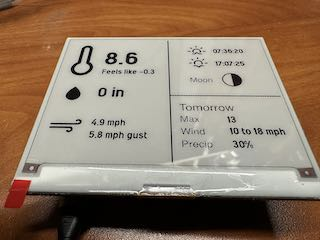

# Inky wHAT weather display

A weather data display for the Inky wHAT e-paper display.

- Pulls live weather data from the Ambient Weather API
- Pulls moon phase and sunrise/sunset from the Visual Crossing API
- Pulls forecast data from the National Weather Service API

## How To

You'll need API keys and such from the API providers.

Get the NWS API URL by sending a GET request to https://api.weather.gov/points/LAT,LONG where LAT and LONG are your latitude and longitude separated by a comma. In the resulting payload, you'll find the station ID (3 letter code) and the grid x/y to use.

Information on setting up and testing your Inky wHAT is at https://learn.pimoroni.com/article/getting-started-with-inky-what

On the Raspberry Pi on which the Inky wHAT is installed, in your home directory:

1. `git clone https://github.com/pimoroni/inky`
2. `git clone https://github.com/skypanther/inkywhat.git`
3. `cd ./inkywhat`
4. Create a virtual environment with `python3 -m venv venv`
5. Activate it with `source venv/bin/activate`
6. `cd ../inky`
7. Depending on your version of Raspbian, you might need to install additional libraries for PIL/Pillow, which is installed by the install.sh script. Run `sudo apt-get install libjpeg-dev zlib1g-dev`
8. `./install.sh` and when prompted, do not create a virtual environment; do install the example files.
9. Reboot when done
10. Use `sudo raspi-config` to enable both SPI and I2C. The installer is supposed to do this but didn't on my system.
11. `source inkywhat/venv/bin/activate`
12. `sudo apt-get install python3-dev`
13. `sudo apt-get install libopenjp2-7`
14. `sudo apt-get install libopenblas-dev`
15. `cd inky`
16. `pip install -r requirements-examples.txt`
17. Run an Inky wHAT sample to be sure your display is working as you expect.
18. `cd ~/inkywhat`
19. Install the required Python dependencies with `pip install -r requirements.txt`
20. Rename config_sample.py to config.py
21. In the Weather.gov section, enter your station ID, grid x/y, your email address, and your application's name.
22. In the Visual Crossing section, enter your city name and two-letter state, and your API key.
23. In the Ambient Weather section, enter your station's MAC address, your API key, and your application key.
24. Save the file.
25. Run `python main.py`

The frequency of API requests is also configurable. However, the default values are chosen a) to reflect that the Inky wHAT display takes many seconds to refresh and has a limited lifespan of refreshes, b) to be nice to the API providers, and c) to pull data at a rate reasonable to how often it changes. For example, the moon phase will not change significantly over short periods of time. So, the default Visual Crossing API calls are every 2 hours. Likewise, forecast data doesn't change too frequently, so that's fetched every 10 mins. Current conditions change by the second. However, remember the e-ink display can't refresh quickly. So, the default is every 2 minutes.

### Weather icons

This project uses the weather icons from https://erikflowers.github.io/weather-icons/

### License

- This repo's code is licensed under the MIT license
- The Weather Icons and the IniSans fonts are licensed under the SIL OFL 1.1
