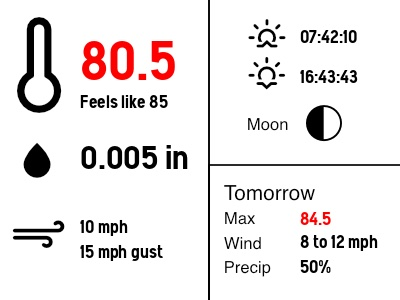

# Inky wHAT weather display

_Current status: pulls weather and astronomical info from the APIs and generates an image; does not write to the Inky wHat yet._

A weather data display for the Inky wHat e-paper display.

- Pulls live weather data from the Ambient Weather API
- Pulls moon phase and sunrise/sunset from the Visual Crossing API
- Pulls forecast data from the National Weather Service API

## How To

You'll need API keys and such from the API providers.

Get the NWS API URL by sending a GET request to https://api.weather.gov/points/LAT,LONG where LAT and LONG are your latitude and longitude separated by a comma. In the resulting payload, you'll find the station ID (3 letter code) and the grid x/y to use.

On the Raspberry Pi on which the Inky wHat is installed:

1. Rename config_sample.py to config.py
2. In the Weather.gov section, enter your station ID, grid x/y, your email address, and your application's name.
3. In the Visual Crossing section, enter your city name and two-letter state, and your API key
4. In the Ambient Weather section, enter your station's MAC address, your API key, and your application key.
5. Save the file.
6. Create a virtual environment with `python3 -m venv venv`
7. Activate it with `source venv/bin/activate`
8. Install the required Python dependencies with `pip install -r requirements.txt`
9. Run `python main.py`

The frequency of API requests is also configurable. The default values are chosen a) to reflect that the Inky wHat display takes many seconds to refresh and has a limited lifespan of refreshes, b) to be nice to the API providers, and c) to pull data at a rate reasonable to how often it changes. For example, the moon phase will not change significantly over short periods of time. So, the default Visual Crossing API calls are every 2 hours. Likewise, forecast data doesn't change too frequently, so that's fetched every 10 mins. Current conditions change by the second. However, remember the e-ink display can't refresh quickly. So, the default is every minute.

### Weather icons

This project uses the weather icons from https://erikflowers.github.io/weather-icons/

### License

- This repo's code is licensed under the MIT license
- The Weather Icons font is licensed under the SIL OFL 1.1
